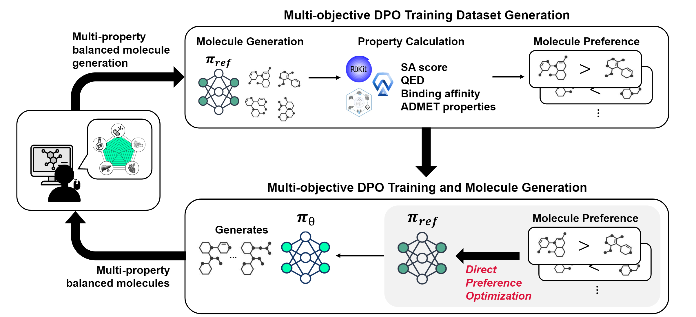

# Target Product Profile-Guided Drug Design Using Multi-objective Direct Preference Optimization

Sejeong Park\*, Jungwoo Park\*, Donghyeon Lee, Sunkyu Kim, Jaewoo Kang (\* indicates equal contribution)

<div align="center">
    
</div>
<br/>

Abstarct: *Fragment-Based Drug Design (FBDD) offers unique advantages in exploring chemical space and optimizing lead compounds. However, existing FBDD approaches often struggle to efficiently meet complex Target Product Profile (TPP) requirements due to the significant time and financial investments typically required in traditional workflows. This study introduces a novel TPP-guided fragment-based generative model that integrates Direct Preference Optimization (DPO) with sequence-based fragment generation. The model transforms multiobjective optimization into a preference learning task, simultaneously optimizing multiple molecular properties from the earliest design stages. Key innovations include In-Batch DPO for computational efficiency and a multi-objective learning strategy balancing diverse molecular properties. Case studies across various therapeutic targets demonstrate significant improvements in generating diverse drug candidates optimized for binding affinity, synthetic accessibility, druglikeness and ADMET properties, potentially accelerating the discovery of novel therapeutics for challenging targets.*

This repository contains the code to reproduce the experiments in the paper.

## Prerequisite

All experiments in this work were conducted on [TPU-v3-8](https://cloud.google.com/tpu/docs/v3). For research purposes, you can apply to [the TRC progam](https://sites.research.google/trc/about/) [here](https://sites.research.google/trc/about/) to receive free TPU quota. To create a TPU VM instance, run the command below:
```bash
$ gcloud compute tpus tpu-vm create tpu-name \
    --zone=europe-west4-a \
    --accelerator-type=v3-8 \
    --version=tpu-vm-base
```
Now you can access the TPU VM through SSH:
```bash
gcloud compute tpus tpu-vm ssh tpu-name --zone=europe-west4-a
```

## Requirements
After preparing TPU instances, install the conda environment.
```bash
$ wget https://repo.anaconda.com/miniconda/Miniconda3-py310_24.1.2-0-Linux-x86_64.sh
$ bash Miniconda3-py310_24.1.2-0-Linux-x86_64.sh -b -u
```
And then, install the requirements via pip:
```bash
$ pip install -U jax[tpu] -f https://storage.googleapis.com/jax-releases/libtpu_releases.html
$ pip install -U torch torchvision torchaudio --index-url https://download.pytorch.org/whl/cpu
$ pip install -U flax optax chex webdataset wandb fsspec gcsfs transformers sentencepiece tiktoken omegaconf safe-mol pandas==2.0.0 admet-ai
```

## Getting Started

### Prepare a Preference Dataset

To support various molecule generation methods, such as de novo and scaffold decoration, we use the [SAFE-GPT](https://huggingface.co/datamol-io/safe-gpt) model with [SAFE](https://arxiv.org/abs/2310.10773) representation.
To apply preference optimization to the model, we first generate molecules and then evaluate their molecular properties.
Unlike conventional preference optimization methods, we only need the molecular properties instead of direct comparison or other preference signals.

We found that de novo generated molecules suffice to optimize the model's entire chemical space, thereby also improving molecules for scaffold decoration and scaffold morphing.
You can follow [this tutorial](https://safe-docs.datamol.io/stable/tutorials/design-with-safe.html#de-novo-generation) to generate molecules yourself or use the command below:
```bash
$ python scripts/generate_de_novo_samples.py \
    --num-samples 100000 \
    --batch-size 256 \
    --max-length 128 \
    --output safe-de-novo-dataset.csv
```
This script automatically evaluates the necessary properties, including SA score, QED, and ADMET scores from [ADMET-AI](https://github.com/swansonk14/admet_ai). We recommend running this script on a GPU environment for faster generation.

If you want to optimize the docking score as well, run [AutoDock-GPU](https://github.com/ccsb-scripps/AutoDock-GPU) to calculate the binding affinity of each molecule and then combine it with the training dataset.
Refer to [scripts/convert_smiles_to_pdbqt.py](scripts/convert_smiles_to_pdbqt.py) for SMILES-to-PDBQT conversion, and then run AutoDock with your target protein.
After running the AutoDock program, you can find the `.dlg` output file containing:
```
AutoDock-GPU version: v1.5.3-73-gf5cf6ffdd0c5b3f113d5cc424fabee51df04da7e

**********************************************************
**    AutoDock-GPU AUTODOCKTOOLS-COMPATIBLE DLG FILE    **
**********************************************************

[...]

    RMSD TABLE
    __________


_______________________________________________________________________
     |      |      |           |         |                 |
Rank | Sub- | Run  | Binding   | Cluster | Reference       | Grep
     | Rank |      | Energy    | RMSD    | RMSD            | Pattern
_____|______|______|___________|_________|_________________|___________
   1      1     19       -6.63      0.00     13.74           RANKING
   1      2      6       -6.63      0.11     13.79           RANKING
   1      3     12       -6.62      0.09     13.76           RANKING
   1      4     14       -6.61      0.23     13.79           RANKING
   1      5     10       -6.60      0.19     13.78           RANKING
   1      6      5       -6.44      0.57     13.69           RANKING
   1      7      2       -6.44      0.60     13.73           RANKING
   1      8     11       -6.43      0.58     13.75           RANKING
   1      9     20       -6.42      0.56     13.78           RANKING
   1     10     15       -6.36      0.58     13.72           RANKING
   1     11     13       -6.22      0.62     13.82           RANKING
   1     12     18       -5.85      0.79     13.57           RANKING
   2      1      9       -6.18      0.00     11.90           RANKING
   2      2     16       -5.90      0.93     11.71           RANKING
   2      3      8       -5.90      0.94     11.72           RANKING
   2      4     17       -5.85      0.97     11.67           RANKING
   3      1      4       -5.73      0.00     11.13           RANKING
   3      2      1       -5.60      1.52     11.86           RANKING
   3      3      3       -5.54      1.54     11.67           RANKING
   4      1      7       -5.53      0.00     11.92           RANKING

Run time 0.225 sec
Idle time 0.161 sec
```
Choose the highest-ranked binding energy as a docking score and merge it into the training dataset with a column name, e.g., `DS_7O2I`.

### Optimize Molecular Properties
Now we can optimize the SAFE-GPT model with our preference dataset.
There are three configuration presets:
- [config/safe-dpo-simple-20ep.sh](config/safe-dpo-simple-20ep.sh): Simple averaging for multi-objective preference optimization.
- [config/safe-dpo-moco-20ep.sh](config/safe-dpo-moco-20ep.sh): Balanced multi-objective preference optimization.
- [config/safe-dpo-moco-20ep-pref.sh](config/safe-dpo-moco-20ep-pref.sh): Balanced multi-objective preference optimization with user preferences.

Using these presets, you can run an experiment with various senarios and property combinations:
```bash
### Simple Averaging ###
bash config/safe-dpo-simple-20ep.sh safe-dpo-simple-20ep-8P1Q_SAScore_QED               ./safe-dpo-full-dataset-94k.csv     "DS_8P1Q:min:5 SAScore:min:1 QED:max:1"
bash config/safe-dpo-simple-20ep.sh safe-dpo-simple-20ep-8P1Q_hERG_CYPs                 ./safe-dpo-full-dataset-94k.csv     "DS_8P1Q:min:5 hERG:min:0 CYP1A2_Veith:min:0 CYP2C9_Veith:min:0 CYP2C19_Veith:min:0 CYP2D6_Veith:min:0 CYP3A4_Veith:min:0"
bash config/safe-dpo-simple-20ep.sh safe-dpo-simple-20ep-8P1Q_SAScore_QED_CYPs          ./safe-dpo-full-dataset-94k.csv     "DS_8P1Q:min:5 SAScore:min:1 QED:max:1 hERG:min:0"
bash config/safe-dpo-simple-20ep.sh safe-dpo-simple-20ep-8P1Q_SAScore_QED_hERG          ./safe-dpo-full-dataset-94k.csv     "DS_8P1Q:min:5 SAScore:min:1 QED:max:1 CYP1A2_Veith:min:0 CYP2C9_Veith:min:0 CYP2C19_Veith:min:0 CYP2D6_Veith:min:0 CYP3A4_Veith:min:0"
bash config/safe-dpo-simple-20ep.sh safe-dpo-simple-20ep-8P1Q_SAScore_QED_hERG_CYPs     ./safe-dpo-full-dataset-94k.csv     "DS_8P1Q:min:5 SAScore:min:1 QED:max:1 hERG:min:0 CYP1A2_Veith:min:0 CYP2C9_Veith:min:0 CYP2C19_Veith:min:0 CYP2D6_Veith:min:0 CYP3A4_Veith:min:0"

### Balanced ###
bash config/safe-dpo-moco-20ep.sh safe-dpo-moco-nopref-20ep-8P1Q_SAScore_QED            ./safe-dpo-full-dataset-94k.csv     "DS_8P1Q:min:5 SAScore:min:1 QED:max:1"
bash config/safe-dpo-moco-20ep.sh safe-dpo-moco-nopref-20ep-8P1Q_hERG_CYPs              ./safe-dpo-full-dataset-94k.csv     "DS_8P1Q:min:5 hERG:min:0 CYP1A2_Veith:min:0 CYP2C9_Veith:min:0 CYP2C19_Veith:min:0 CYP2D6_Veith:min:0 CYP3A4_Veith:min:0"
bash config/safe-dpo-moco-20ep.sh safe-dpo-moco-nopref-20ep-8P1Q_SAScore_QED_CYPs       ./safe-dpo-full-dataset-94k.csv     "DS_8P1Q:min:5 SAScore:min:1 QED:max:1 hERG:min:0"
bash config/safe-dpo-moco-20ep.sh safe-dpo-moco-nopref-20ep-8P1Q_SAScore_QED_hERG       ./safe-dpo-full-dataset-94k.csv     "DS_8P1Q:min:5 SAScore:min:1 QED:max:1 CYP1A2_Veith:min:0 CYP2C9_Veith:min:0 CYP2C19_Veith:min:0 CYP2D6_Veith:min:0 CYP3A4_Veith:min:0"
bash config/safe-dpo-moco-20ep.sh safe-dpo-moco-nopref-20ep-8P1Q_SAScore_QED_hERG_CYPs  ./safe-dpo-full-dataset-94k.csv     "DS_8P1Q:min:5 SAScore:min:1 QED:max:1 hERG:min:0 CYP1A2_Veith:min:0 CYP2C9_Veith:min:0 CYP2C19_Veith:min:0 CYP2D6_Veith:min:0 CYP3A4_Veith:min:0"

### Balanced w/ Preferences ###
bash config/safe-dpo-moco-20ep-pref.sh safe-dpo-moco-20ep-8P1Q_SAScore_QED              ./safe-dpo-full-dataset-94k.csv     "DS_8P1Q:min:5 SAScore:min:1 QED:max:1"
bash config/safe-dpo-moco-20ep-pref.sh safe-dpo-moco-20ep-8P1Q_hERG_CYPs                ./safe-dpo-full-dataset-94k.csv     "DS_8P1Q:min:5 hERG:min:0 CYP1A2_Veith:min:0 CYP2C9_Veith:min:0 CYP2C19_Veith:min:0 CYP2D6_Veith:min:0 CYP3A4_Veith:min:0"
bash config/safe-dpo-moco-20ep-pref.sh safe-dpo-moco-20ep-8P1Q_SAScore_QED_CYPs         ./safe-dpo-full-dataset-94k.csv     "DS_8P1Q:min:5 SAScore:min:1 QED:max:1 hERG:min:0"
bash config/safe-dpo-moco-20ep-pref.sh safe-dpo-moco-20ep-8P1Q_SAScore_QED_hERG         ./safe-dpo-full-dataset-94k.csv     "DS_8P1Q:min:5 SAScore:min:1 QED:max:1 CYP1A2_Veith:min:0 CYP2C9_Veith:min:0 CYP2C19_Veith:min:0 CYP2D6_Veith:min:0 CYP3A4_Veith:min:0"
bash config/safe-dpo-moco-20ep-pref.sh safe-dpo-moco-20ep-8P1Q_SAScore_QED_hERG_CYPs    ./safe-dpo-full-dataset-94k.csv     "DS_8P1Q:min:5 SAScore:min:1 QED:max:1 hERG:min:0 CYP1A2_Veith:min:0 CYP2C9_Veith:min:0 CYP2C19_Veith:min:0 CYP2D6_Veith:min:0 CYP3A4_Veith:min:0"
```
Each script requires three arguments.
- The first argument is the experiment name.
- The second argument is the path to the training dataset constructed in the section above.
- The third argument specifies the target molecular properties in the format: `[column]:[min/max]:[pref]`.

For instance, `DS_8P1Q:min:5 SAScore:min:1 QED:max:1 hERG:min:0` minimizes the docking score of protein 8P1Q, the SA score, and the hERG channel blocking, while maximizing the QED drug-likeness score.
With the preset [config/safe-dpo-moco-20ep-pref.sh](config/safe-dpo-moco-20ep-pref.sh), the balanced loss weights will focus more on the docking score since its preference strength is 5.

## Citation
```bibtex
@misc{park2024tppmoldpo,
      title={Target Product Profile-Guided Drug Design Using Multi-objective Direct Preference Optimization},
      author={Sejeong Park, Jungwoo Park, Donghyeon Lee, Sunkyu Kim, Jaewoo Kang},
      year={2024},
}
``` 
